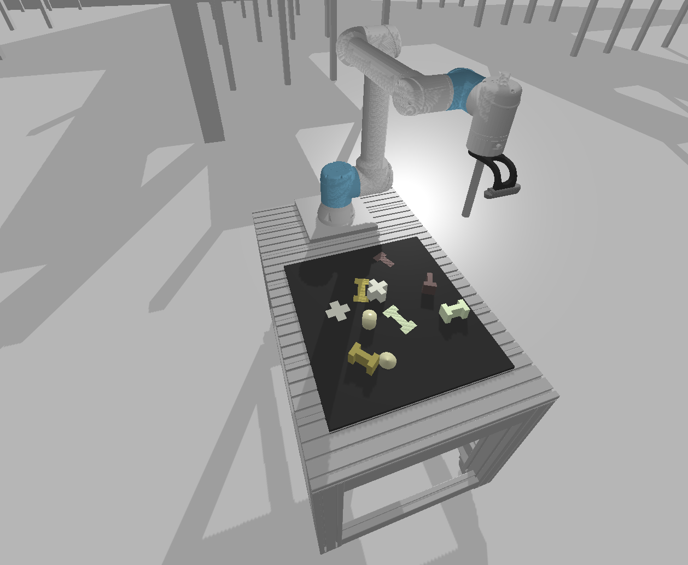

# Robot programming HKA WS 2024/25

This repository contains the code for the robot programming course (the policy learning part) at the University of Applied Sciences Karlsruhe.

We will use and update this repository throughout the course.

## Quick start

### Environment setup

**Requirements:** Have docker installed including the post-installation steps.

**Note:** The default settings are for nvidia GPU support. If you don't have an nvidia GPU, remove the `--gpus all` flag from the `docker run` command in `run_container_rl.sh`.

**WSL2:** You can also use Docker with WSL2 on Windows. Make sure to follow the [Docker WSL2 installation guide](https://docs.docker.com/docker-for-windows/wsl/) to set up Docker with WSL2.

Build the docker image with

```bash
./build_image_rl.sh
```

Run the container with
```bash
./run_container_rl.sh
```

## Task

### Alignment via Pushing:​

The workspace contains objects of different shapes and colors, with a designated area for each object. The task is for the robot to push the objects into areas that are shaped to match the object (e.g. a circular object into a circular area). The objects and areas should be randomly placed, and the robot must align each object to its corresponding area by pushing.



## Script Descriptions

### train_DQN.py
This script is used to train a Deep Q-Network (DQN) agent for the pushing environment. It sets up the environment, initializes the agent, and runs the training loop. The script also handles logging, plotting, and saving the model periodically. Additionally, it supports loading different network architectures such as ResNet, FCN, and CNN based on the configuration.

### test_env.py
This script is used to test the environment setup and visualize the observations from different cameras. It helps in debugging the environment and ensuring that all components are instantiated correctly.

### play_game.py
This script allows manual control of the robot in the pushing environment. It provides a simple interface to move the robot using keyboard inputs and visualize the camera feed. It can also run in an automatic mode where the robot performs predefined actions.

### play_DQN.py
This script is used to run a trained DQN agent in the pushing environment. It loads the trained model and runs test episodes. It can also render the environment to visualize the agent's performance.

## Changing Parameters

### YAML Configuration Files
The parameters for the scripts are defined in YAML configuration files located in the `config` directory. These files allow you to customize various aspects of the environment, agent, and training process.

### Example Configuration
Here is an example of a configuration file (`config/train_DQN.yaml`):

```yaml
render: True
model_type: ResNet
num_episodes: 1000
max_steps_per_episode: 200
batch_size: 32
target_update_freq: 10
plot_freq: 50
save_freq: 100
model_dir: "models/"
plot_dir: "plots/"
# ... other parameters ...
```

### Configuration File Locations
There are many other configuration files in the `config` directory. The following two are particularly noteworthy:
- The rewards for the training are specified in the `config/pushing_env/pushing_env.yaml` file.
- Each DQN agent network type has its own configuration file located in the `config/agent` directory.

The rest of the configuration files are self-explanatory and can be explored as needed.

### How to Change Parameters
1. Open the relevant YAML file in the `config` directory.
2. Locate the parameter you want to change.
3. Modify the value of the parameter.
4. Save the file.

### Running with Custom Parameters
When you run a script, it will automatically use the parameters defined in the corresponding YAML file. For example, to run the `train_DQN.py` script with the custom parameters, use:

```bash
python src/scripts_rl/train_DQN.py
```

You can also override parameters directly from the command line using Hydra's syntax. For example:

```bash
python src/scripts_rl/train_DQN.py model_type=FCN num_episodes=500
```

This will override the `model_type` and `num_episodes` parameters for that run.
